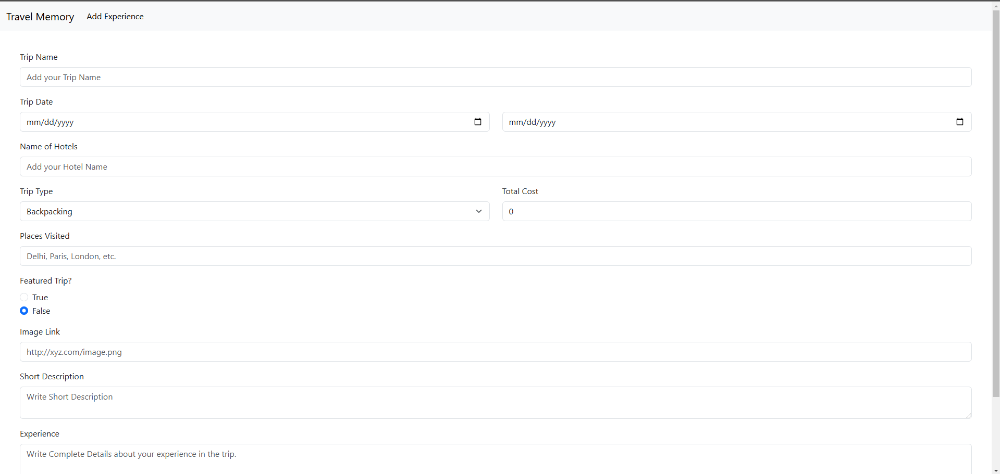
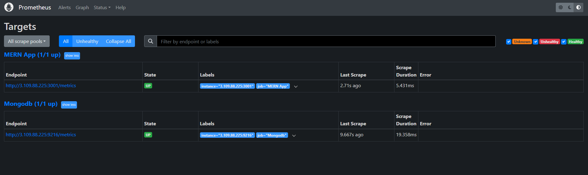
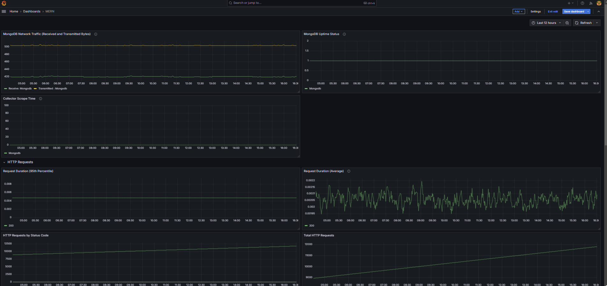
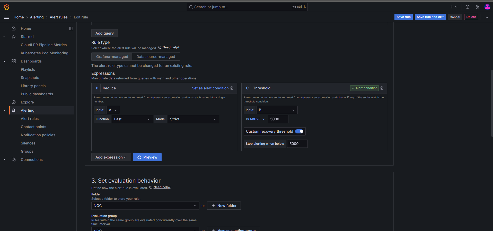
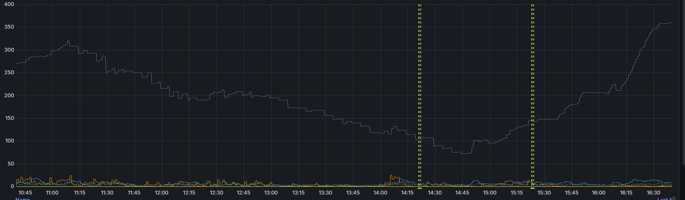

# Advanced Monitoring Setup for a MERN Application with Grafana and Prometheus

This README outlines the steps to implement a robust monitoring system for a MERN (MongoDB, Express.js, React.js, Node.js) application. The monitoring stack includes Grafana and Prometheus for metric collection and visualization, Loki (or alternatives) for log aggregation, and Jaeger (or Zipkin) for distributed tracing. This setup enables end-to-end monitoring, offering insights into backend, frontend, and database performance as well as application behavior.

---

## Table of Contents
1. [Objective](#objective)
2. [System Architecture Overview](#system-architecture-overview)
3. [Prerequisites](#prerequisites)
4. [Setup Instructions](#setup-instructions)
    - [Step 1: Set up the MERN Application](#step-1-set-up-the-mern-application)
    - [Step 2: Integrate Prometheus for Metrics Collection](#step-2-integrate-prometheus-for-metrics-collection)
    - [Step 3: Build Grafana Dashboards for Metrics Visualization](#step-3-build-grafana-dashboards-for-metrics-visualization)
    - [Step 4: Implement Log Aggregation](#step-4-implement-log-aggregation)
    - [Step 5: Add Distributed Tracing](#step-5-add-distributed-tracing)
    - [Step 6: Configure Alerting and Anomaly Detection](#step-6-cofigure-alerting-and-anomaly-detection)
5. [Conclusion](#conclusion)

---
## Objective
To design and implement a complete monitoring solution for a full-stack JavaScript application. This setup provides:

- Performance metrics for the backend, frontend, and database.
- Log aggregation for centralized log analysis.
- Distributed tracing for tracking request flow through the system.
- Alerting and anomaly detection to detect and notify about issues proactively.

## System Architecture Overview
The architecture for this monitoring setup includes:

- Prometheus for scraping and storing metrics.
- Grafana for dashboard visualizations, with Prometheus and Loki as data sources.
- MongoDB Exporter for MongoDB-specific metrics.
- Loki or ELK Stack for centralized logging.
- Jaeger or Zipkin for distributed tracing.


## Prerequisites
- Operating System: Linux or WSL (Windows Subsystem for Linux) with Ubuntu.
- Docker: Recommended for containerized setup of Prometheus, Grafana, Loki, and Jaeger.
- Basic MERN Application: Travel memory app or similar to use for monitoring.
- JavaScript and Node.js Knowledge: Required to instrument the backend with  custom metrics.


## Setup Instructions
### Step 1: Set up the MERN Application
1. Clone or Build the Application: Use a MERN application template, or build a new one. Ensure that the backend is a Node.js API using Express, with MongoDB as the database.
2. Run the Application Locally: Start MongoDB, the Node.js backend, and React frontend, ensuring each component works independently.



### Step 2: Integrate Prometheus for Metrics Collection
1. Install Prometheus:

- Run Prometheus in Docker using:
```bash
docker run -p 9090:9090 prom/prometheus
```
- Configure ```prometheus.yml``` to scrape data from the Node.js backend and MongoDB Exporter.

Note: Added docker-compose and prometheus.yml in the repo

2. Instrument the Node.js Backend:

- Install Prometheus client for Node.js:
```bash
npm install prom-client
```
- Create custom metrics in your backend (e.g., response times, request counts, error rates):
```javascript
const client = require('prom-client');
const httpRequestDurationMicroseconds = new client.Histogram({
  name: 'http_request_duration_ms',
  help: 'Duration of HTTP requests in ms',
  labelNames: ['method', 'route', 'code']
});
```
- Expose metrics endpoint in your backend (e.g., ```/metrics```).

3. Monitor MongoDB:

- Use MongoDB Exporter to collect metrics on database operations, latency, and connection status. Configure Prometheus to scrape MongoDB Exporter data.




### Step 3: Build Grafana Dashboards for Metrics Visualization
1. Install Grafana:

- Run Grafana in Docker:
```bash
docker run -p 3000:3000 grafana/grafana
```
- Connect Prometheus as a data source in Grafana.
2. Create Grafana Dashboards:

- Set up custom dashboards for each component:
  - Backend Dashboard: Visualize API response times, error rates, and request counts.
  - Database Dashboard: Display MongoDB latency, query counts, and active connections.
  - Frontend Dashboard (optional): Add frontend performance metrics if you have monitoring for React.
3. Add Panels and Alerts:

- Customize panels and set alert thresholds for essential metrics (e.g., high error rates or slow response times).


### Step 4: Implement Log Aggregation
Set up Loki:

- To collect and aggregate logs from the backend, run Loki in Docker:
```bash
docker run -p 3100:3100 grafana/loki
```
- Install Winston Loki for Node.js, or configure an ELK Stack for more complex log aggregation.
2. Configure Grafana to Use Loki/ELK Stack:

- Add Loki as a data source in Grafana.
- Create a dashboard for log visualization with search and filter capabilities.

### Step 5: Add Distributed Tracing
1. Install Jaeger or Zipkin:

- Run Jaeger in Docker:
```
docker run -p 16686:16686 -p 14250:14250 jaegertracing/all-in-one:latest
```
2. Instrument Distributed Tracing in Node.js:

- Install OpenTelemetry for Node.js:
```bash
npm install @opentelemetry/api @opentelemetry/node
```
- Capture traces for requests to the backend:
```javascript
const { NodeTracerProvider } = require('@opentelemetry/node');
const { SimpleSpanProcessor } = require('@opentelemetry/tracing');
// Configure Jaeger exporter
```
3. Integrate with Grafana:

- Use Grafana’s Jaeger data source to visualize request flow and latencies.

### Step 6: Cofigure Alerting and Anomaly Detection
1. Set Up Alerts in Grafana:

- Add alert rules based on backend metrics (e.g., response time, error rate) and MongoDB status.
- Configure notification channels (email, Slack) for alert delivery.
2. Enable Anomaly Detection:

- Set anomaly detection rules for unusual spikes or patterns in application metrics and logs.



### Conclusion
This guide provided an end-to-end setup for monitoring, logging, and tracing in a MERN application using Grafana, Prometheus, Loki, and Jaeger. The setup enables developers to monitor application performance, quickly troubleshoot issues, and gain insight into resource usage and behavior.